# Workshop Hands-On AI/BI Dashboards — Laboratorio 1

Treinamento Hands-on na plataforma Databricks com foco nas funcionalidades de Análise Exploratória e Painéis.
</br></br>

## Objetivos do Exercício

O objetivo desse laboratório é montar um Painel, utilizando os dados de ações das Big Tech da NASDAQ.</br> 
</br></br>


## Exercício 01 - Criando o Dashboard

No Menu Lateral, escolha a opção DASHBOARDS:

Clique na opção **CREATE DASHBOARD**

Na tela do Dashboard, clique na ABA **"Data"** para adicionar uma fonte de dados:

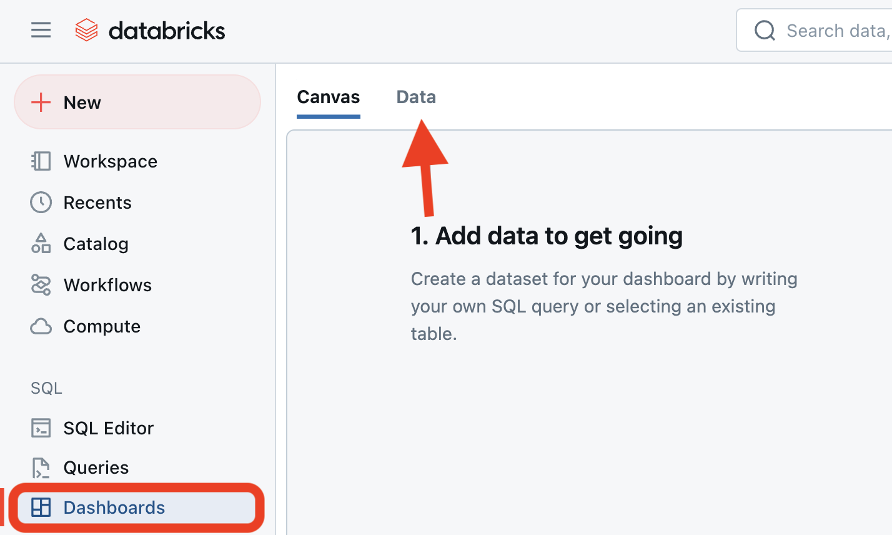</br>

1 - Escolha a opção *"Add SQL Dataset"*

2 - Copie a consulta abaixo e cole no editor (não se esqueça de incluir seu banco de dados)
```sql
SELECT * 
  FROM dbacademy.workshop_aibi.stocks
```

3 - Clique em *"Run"*

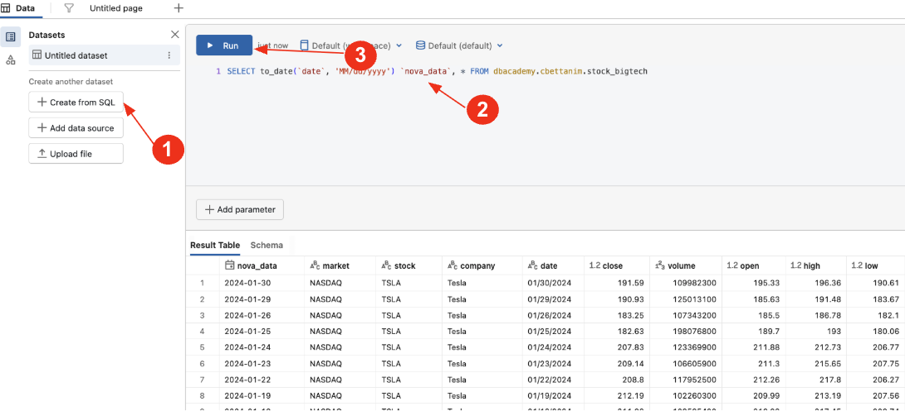


Vá para a aba de dashboard *"Untitled page"*.  </br>

No canto superior direito, selecione o ícone da Genie Code.

Na caixa de diálogo insira a seguinte informação:
``` md
gráfico de linhas do valor de fechamento por dia e por empresa
```

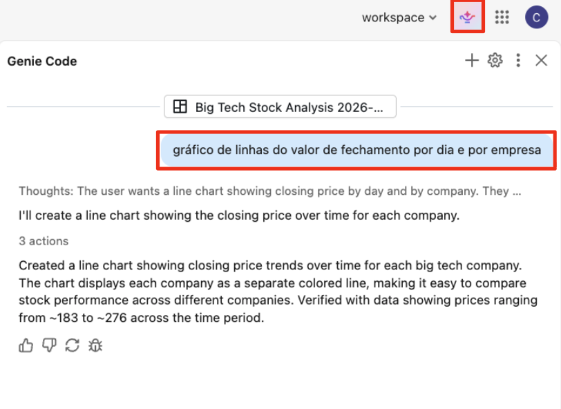

</br></br>
Um gráfico foi gerado como no exemplo abaixo:
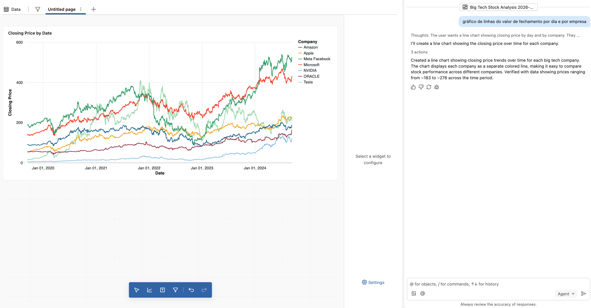
</br></br></br>

## Exercício 02 - Adicionando um FILTRO de página

Clique no menu azul suspenso no ícone de FILTRO.</br>
Escolha o atributo (Field):  "**company**"
</br></br>
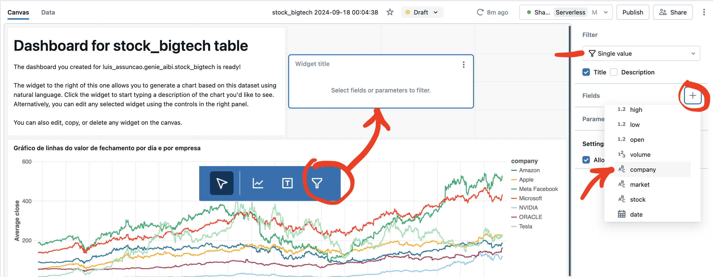
</br></br></br>


## Exercício 03 - Alterando o título do painel por uma imagem

Crie agora um novo objeto do tipo TEXT. No box que foi criado </br>
insira o código (markdown) abaixo: </br>
</br>

``` sql

```

</br></br>
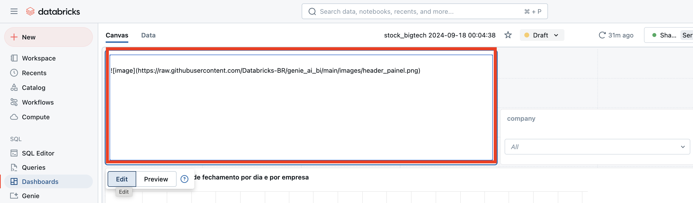
</br></br></br>


Organize o layout do dashboard para que fique com a aparência da imagem abaixo.</br>
Faça o devido alinhamento do gráfico no layout.</br>
Altere o nome do Dashboard na barra superior.</br>
Clique no botão "**Publish**" para publicar o Painel.
</br></br>
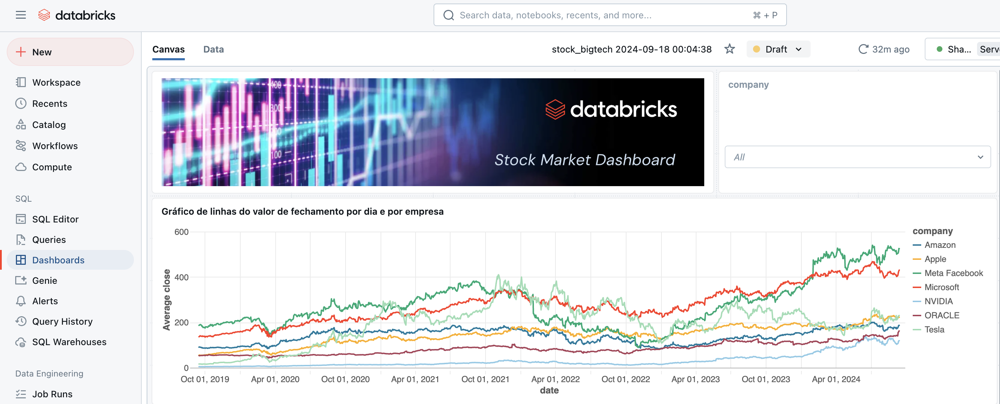
</br></br></br>


## Exercício 04 - Criando um NOVO contexto de dados

Vá até *"Data (Dados)"*

1 - Escolha a opção *"Add SQL Dataset"*

2 - Copie a consulta abaixo e cole no editor 
``` sql

SELECT 
  "https://raw.githubusercontent.com/Databricks-BR/genie_ai_bi/main/images/" || stock || ".png" AS image,
  company,
  stock,
  MIN(close) AS min_close,
  MAX(close) AS max_close,
  ((MAX(close) - MIN(close)) / MIN(close) * 100) AS percentual_variacao
FROM dbacademy.workshop_aibi.stocks
GROUP BY company, stock;
```

3 - Nomeie a consulta como **"tendencias""**

</br>
Ao executar a query (botão RUN),</br>
o resultado esperado é o mostrado abaixo:</br>
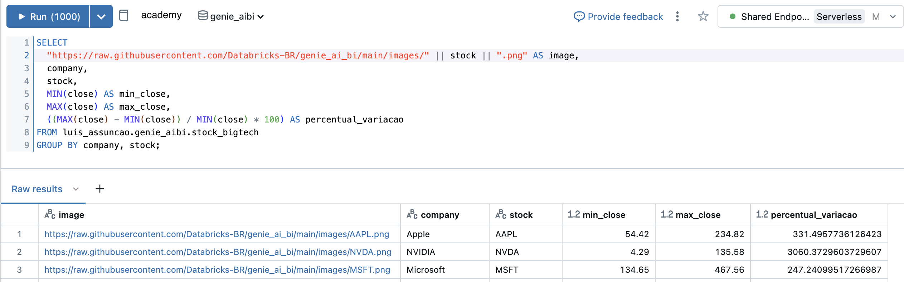
</br></br></br>

## Exercício 05 - Adicionando um novo Gráfico com o contexto novo de dados

1. Clique no menu azul suspenso na posição inferior do painel, </br>
no botão com o ícone de gráfico </br>
2. Na barra de configuração (lateral direita do painel),</br>
escolha o nome do Dataset (que veio do Genie Code).</br> 
3. Configure o tipo de Visualização para "Table"(Tabela).</br>
4. Na opção Columns (Colunas) clique no sinal "+".
5. Selecione a opção "Add all (Adicionar todos)"

</br></br>
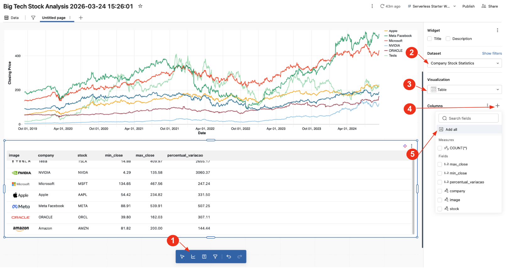
</br></br></br>

6. Passe o mouse na coluna image e selecione a seta para baixo.</br>
7. Clique em "Style (Estilo)".
8. Em "Display Type" selecione a opção "Image (Imagem)"
9. Em "Height (Altura)" digite o valor 25
</br></br>
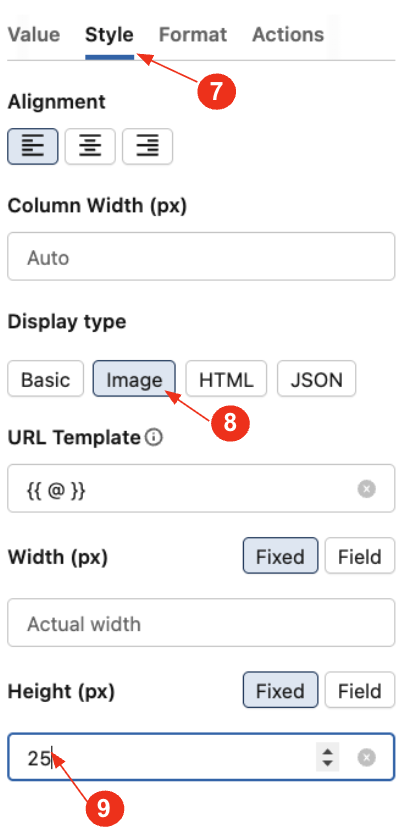
</br></br></br>

Como resultado esperado, teremos a figura abaixo.</br>
Salve (Publique) novamente o Painel.
</br></br>
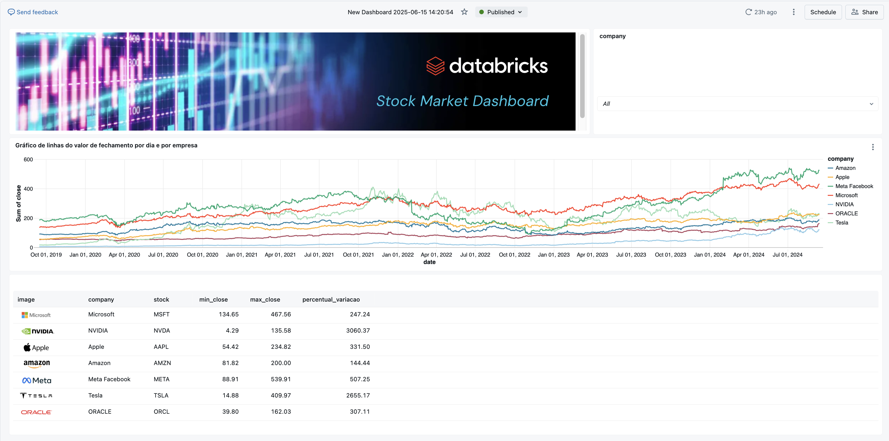
</br></br></br>


[FIM]


