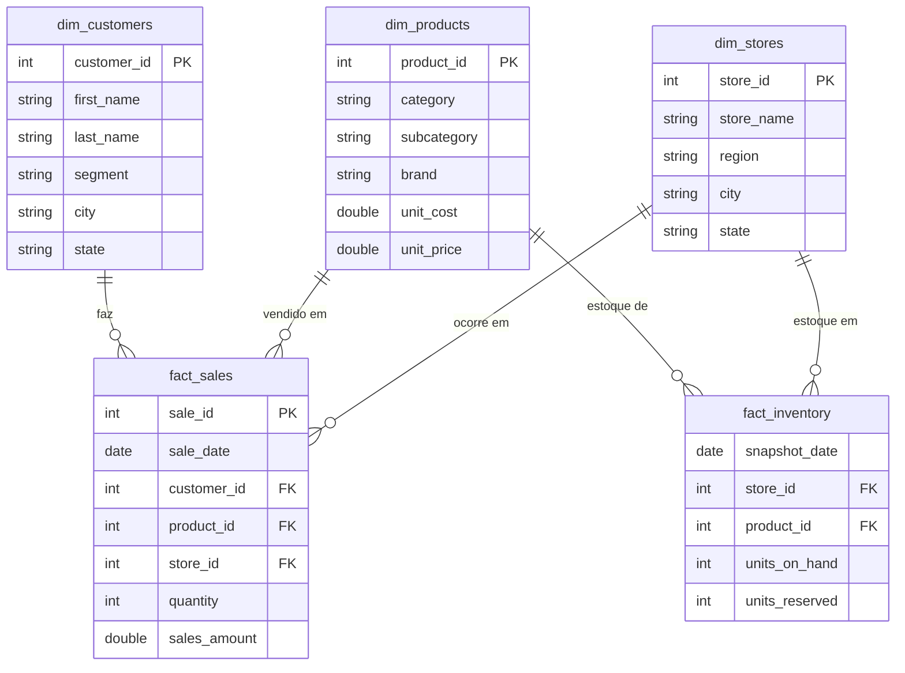
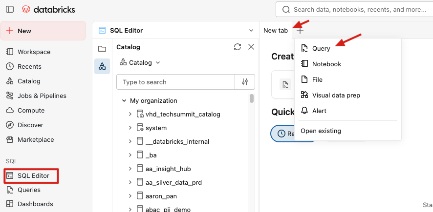
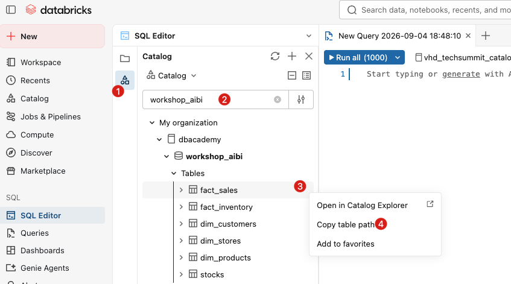
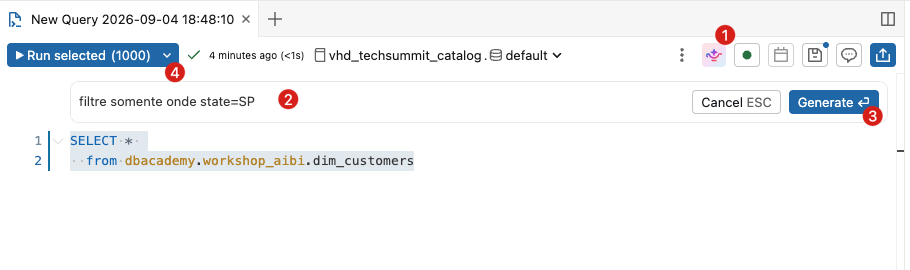

# O caso de uso: dados de varejo (retail)

Estes são os dados da **TabajaraBrasil** (o cenário da seção anterior): um modelo estrela clássico de varejo. Todas as tabelas ficam em `<seu_catalogo>.workshop_aibi_tabajarabrasil`.

**[SUBSTITUA AQUI]** troque `<seu_catalogo>` pelo catálogo onde você tem permissão de escrita (ex.: `main`, `workspace`, ou seu catálogo pessoal). O schema `workshop_aibi_tabajarabrasil` é criado pelo notebook.

As tabelas (as únicas que existem neste conjunto):

- **dim_customers** (dimensão de clientes) — colunas: `customer_id`, `first_name`, `last_name`, `email`, `city`, `state`, `country` (Brasil), `segment` (Consumer / Corporate / Home Office), `gender`, `age`, `signup_date`.
- **dim_products** (dimensão de produtos de moda) — colunas: `product_id`, `category` (Feminino / Masculino / Infantil / Moda Íntima / Esportes / Calçados / Acessórios / Praia), `subcategory` (ex.: Vestido, Calça Jeans, Tênis Esportivo, Biquíni…), `season` (Primavera / Verão / Outono / Inverno / Ano todo), `brand`, `product_name`, `unit_cost`, `unit_price`.
- **dim_stores** (dimensão de lojas) — colunas: `store_id`, `city`, `state`, `region` (Sudeste / Sul / Nordeste / Norte / Centro-Oeste), `country` (Brasil), `latitude`, `longitude`, `store_name`, `open_date`.
- **fact_sales** (fato de vendas, ~100 mil linhas em 24 meses) — colunas: `sale_id`, `sale_date`, `customer_id`, `product_id`, `store_id`, `quantity`, `unit_price`, `discount_pct`, `sales_amount`.
- **fact_inventory** (fato de estoque, snapshots mensais) — colunas: `snapshot_date`, `store_id`, `product_id`, `units_on_hand`, `units_reserved`.

Dois pontos importantes que valem para todo o material:

- **Receita** = coluna `sales_amount` (já vem calculada como `quantity * unit_price * (1 - discount_pct)`).
- **Custo NÃO está no fato.** O custo unitário está em `dim_products.unit_cost`. Sempre que precisarmos de custo ou margem, faremos um **join** de `fact_sales` com `dim_products`.

**Analogia do modelo estrela:** a tabela de fatos (`fact_sales`) é o centro da estrela — cada linha é um evento (uma venda). As dimensões (`dim_products`, `dim_stores`, `dim_customers`) são as "pontas" que descrevem o contexto daquele evento (qual produto, qual loja, qual cliente).

### Diagrama do modelo (esquema estrela)

O relacionamento entre as tabelas de **fato** e **dimensão**:



**Legenda:** `PK` = chave primária, `FK` = chave estrangeira. As conexões `||--o{` são relações **um-para-muitos**: um registro de dimensão (ex.: um produto) se relaciona com muitas linhas do fato (muitas vendas). Note que `fact_sales` liga-se às três dimensões, enquanto `fact_inventory` liga-se apenas a `dim_stores` e `dim_products`.

### Explorando os dados

#### Através do Unity Catalog

Abra o catálogo de dados (Unity Catalog) e explore o conteúdo disponível:
- No menu lateral, escolha a opção **Catalog**
- Procure por **dbacademy**. Esse é o nome do catálogo q estaremos utilizando
- Selecione o schema **workshop_aibi**. Aqui onde estão as tabelas com as informações
- Expanda a lista de tabelas. Clique nas tabelas e navegue nos menus (principalmente o sample data) para entender seu conteúdo

#### Através do Query Editor

- No menu lateral, no grupo SQL, escolha **SQL Editor**
- clique em "Create new SQL Query" ou no botão "+" e escolha query


- Flitre o schema workshop_aibi, selecione a tabela fact_sales e copie o **table-path**


- Agora você pode explorar o conteúdo das tabelas de uma forma mais avançada, através de comandos SQL.

##### Exemplo 1:

Digite:
```
SELECT * 
  FROM dbacademy.workshop_aibi.dim_customers
```
clique no botão **Run All**

Para quem conhece a linguagem SQL, essa é uma poderosa ferramenta para explorar o conteúdo disponível nas tabelas.

Para facilitar a vida, você pode editar o comando usando o Genie **CODE**, se preferir:
- Selecione o assistente do Genie e peça para filtrar conforme abaixo:
```
filtre somente onde state=SP
```


##### Exemplo 2:

Abra uma nova query e utilize o Genie **CODE**

Digite a seguinte instrução:
```
Considere a tabela dbacademy.workshop_aibi.fact_sales como minha tabela principal.

Liste a quantidade de vendas por loja.
```