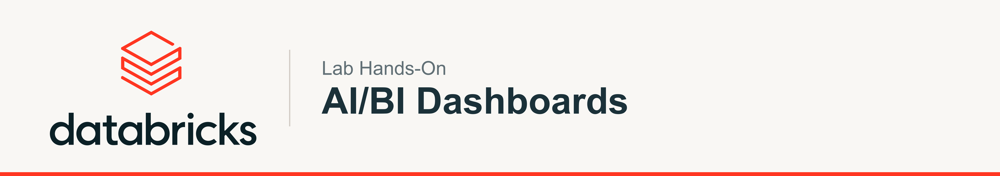

# Workshop Hands-On AI/BI Dashboards — Laboratorio 2

Bem-vindo(a) ao material completo do workshop **AI/BI Dashboards na Prática**. Este guia leva você do zero — dados crus — até um dashboard publicado, compartilhado e governado na Databricks, cobrindo desde o básico até casos avançados.

**Este material vai muito além do que dá tempo de fazer ao vivo.** Ele é o seu guia de referência completo — leve-o para casa e avance no seu ritmo até os casos mais avançados (metric views, embedding, automação e APIs).

# O caso TabajaraBrasil: contexto e propósito

Antes de sair criando gráficos, vamos entender **o quê** e **por quê**. Todo o laboratório gira em torno de uma empresa fictícia: a **TabajaraBrasil**.

A **TabajaraBrasil** é uma rede de lojas de roupas cuja marca nasceu do... não posso contar (só os mais antigos saberão). Em poucos anos ela cresceu: dezenas de lojas em várias regiões, vendas online e presencial, milhares de clientes e um catálogo grande de produtos.

O problema: os dados de **vendas, estoque, produtos e clientes** já estão no lakehouse, mas a diretoria ainda decide "no achismo". Ninguém enxerga com clareza **quais categorias vendem mais, quais regiões crescem, qual é a margem, como está a sazonalidade** ou **quem são os melhores clientes**. Os relatórios chegam tarde, em planilhas soltas, e cada time olha um número diferente.

Por isso a direção decidiu tornar a TabajaraBrasil uma empresa **data-driven** e escolheu os **AI/BI Dashboards da Databricks**. No workshop, **você é o time de dados** que vai construir esse painel.

### Por que criar visualizações (e não só olhar tabelas)?

- **Enxergar padrões em segundos:** um gráfico de linha revela a tendência que uma tabela de 100 mil linhas esconde.
- **Alinhar todo mundo no mesmo número:** uma "fonte da verdade" visual evita seis versões da mesma planilha.
- **Decidir com dados, não no achismo:** onde abrir loja, qual produto priorizar, onde a margem aperta.
- **Contar uma história:** visualização é comunicação — transforma dado em ação.

### Por que fazer isso na Databricks?

- **Os dados já estão lá:** o dashboard consulta o lakehouse direto — sem exportar nem duplicar (sem ETL extra).
- **Governança nativa (Unity Catalog):** permissões, linhagem e auditoria no mesmo lugar.
- **Sem licença por assento:** compartilhe com a empresa inteira sem custo por usuário.
- **Rápido e com IA:** o **Genie Code** cria dashboards a partir de linguagem natural, com performance de sobra (SQL Warehouse + Photon).
- **Tudo num lugar só:** do dado cru ao dashboard publicado, sem trocar de ferramenta.

### As perguntas de negócio que vamos responder

Cada exercício responde a uma pergunta real da TabajaraBrasil:

- **Quanto vendemos e qual é o ticket médio?** → counters (KPIs)
- **Como a receita evolui no tempo e o que esperar?** → gráfico de linha + AI Forecast
- **Quais são os produtos campeões?** → tabela Top 10
- **Onde vendemos mais (região) e para quem (segmento)?** → barras e mapa
- **Estamos lucrando?** → margem (cálculo personalizado)

> **Em resumo:** não vamos só "clicar botões" — vamos construir, passo a passo, o painel que ajuda a TabajaraBrasil a decidir melhor. Os dados de exemplo da próxima etapa simulam exatamente esse cenário.

# Como usar este material

Pense neste guia como uma **receita de cozinha**: cada etapa se apoia na anterior. Você começa preparando os ingredientes (os dados), depois monta o prato principal (o dashboard) e, por fim, aprende a servir e a compartilhar (publicar e governar).

Convenções que usamos o tempo todo:

- **[SUBSTITUA AQUI]** — sempre que você vir este marcador, é onde você troca o nosso exemplo pelas **suas próprias informações** (seu catálogo, seu schema, sua tabela). Se você trouxe dados próprios, é nesses pontos que você aponta para as suas tabelas.
- Blocos de código mostram SQL ou expressões prontas para copiar.
- "Pré-requisitos e permissões" aparecem no início de cada etapa: confira antes de começar.

Ao longo de todo o material usamos um único caso de uso — **varejo (retail)** — para que os exercícios façam sentido em conjunto, como um projeto real de ponta a ponta.
