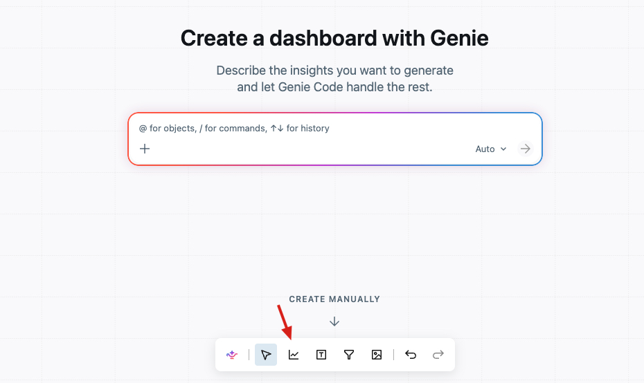
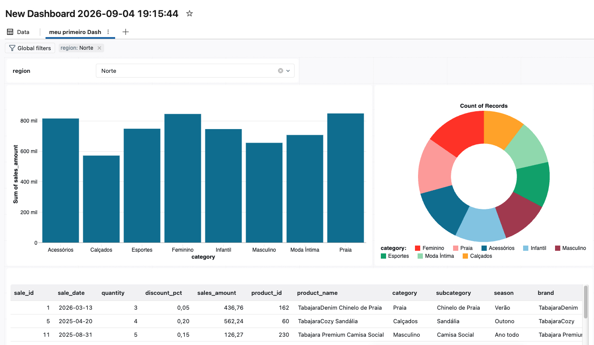

# Etapa 1 — Fundamentos: seu primeiro dashboard e dataset

**Pré-requisitos e permissões:** workspace + Databricks SQL; CAN USE em um SQL Warehouse; SELECT nas tabelas de retail.

### 6.1 Conceitos que você vai usar

- **Dataset:** a consulta (ou tabela) que alimenta as visualizações. Fica empacotado junto com o dashboard.
- **Canvas e páginas:** a área onde você arruma os widgets; um dashboard pode ter várias páginas.
- **Widget:** cada gráfico, tabela, filtro ou texto no canvas.
- **Rascunho vs. Publicado:** enquanto você edita, está no **rascunho** (só editores veem). Quando você **publica**, cria-se um "instantâneo" que os visualizadores enxergam — nada muda para eles até você republicar.

**Analogia:** o rascunho é a cozinha (onde você experimenta); o publicado é o prato que vai para a mesa do cliente.

### 6.2 Criar o dashboard e o primeiro dataset

**Passos:**

**1. Criar o dashboard.** No menu lateral, vá em **SQL → Dashboards** e clique no botão **Create dashboard** (ou **New → Dashboard**).


**2. O dashboard novo abre (rascunho)** com as abas **Data** e **Canvas**. Você pode criar com **Genie Code** (IA) na caixa central ou com **CREATE MANUALLY**. Para definir os dados manualmente, vá para a aba **Data** (no topo).


**3. Adicione o dataset.** Na aba **Data**, clique em **Add SQL dataset** (ou **Add data** para escolher uma tabela existente). Boa prática de segurança: **nunca use `SELECT *`** — liste as colunas explicitamente (num dashboard, os dados do resultado ficam acessíveis no navegador mesmo sem aparecer nos gráficos).


**4. Escreva e rode a consulta.** Cole a consulta abaixo (cria um **dataset enriquecido** juntando o fato às dimensões), escolha o **SQL Warehouse** e clique em **Run**. Nesta tela também estão **Generate** (SQL por IA), **Add parameter** e **Add custom calculation**.

```sql
-- Dataset principal: vendas enriquecidas
SELECT
  f.sale_id,
  f.sale_date,
  f.quantity,
  f.discount_pct,
  f.sales_amount,
  p.product_id,
  p.product_name,
  p.category,
  p.subcategory,
  p.season,
  p.brand,
  p.unit_cost,
  s.store_id,
  s.store_name,
  s.region,
  s.state,
  s.country,
  c.customer_id,
  c.segment
FROM dbacademy.workshop_aibi.fact_sales f
JOIN dbacademy.workshop_aibi.dim_products  p ON f.product_id  = p.product_id
JOIN dbacademy.workshop_aibi.dim_stores    s ON f.store_id    = s.store_id
JOIN dbacademy.workshop_aibi.dim_customers c ON f.customer_id = c.customer_id
```

**O que esta consulta faz (linha a linha):**

Lembre do nosso modelo estrela: `fact_sales` guarda **as vendas** (o que aconteceu), mas só com **IDs** (`product_id`, `store_id`, `customer_id`) — não os nomes. Quem descreve esses IDs são as **dimensões** (`dim_products`, `dim_stores`, `dim_customers`). Esta consulta **junta tudo em uma única "tabela ampla" (dataset enriquecido)** que alimentará todos os gráficos.

- **`SELECT ...`** — escolhe **explicitamente** as colunas que vamos usar: as métricas da venda (`quantity`, `discount_pct`, `sales_amount`) e os atributos "descritivos" das dimensões (`category`, `season`, `region`, `state`, `segment`…). É o que nos deixa cruzar receita por categoria, por região, por estação, etc.
- **`FROM fact_sales f`** — partimos da tabela de fatos (o centro da estrela). O `f` é um **apelido** (alias) para encurtar as referências.
- **`JOIN dim_products p ON f.product_id = p.product_id`** — "cola" cada venda ao seu produto, trazendo `category`, `brand`, `unit_cost`, etc. Repetimos o mesmo para **lojas** e **clientes**. Cada `JOIN` acrescenta as colunas daquela dimensão a cada linha de venda.

**Por que executamos isto (e por que agora):** o **Run** valida a consulta e mostra o resultado no **Result Table**, para você conferir que os joins estão certos **antes** de construir gráficos. Este dataset vira a **base reutilizável** — todos os widgets do dashboard vão beber dele.

**Por que SQL em vez de "adicionar uma tabela" direta?**

- **Uma tabela sozinha não basta.** `fact_sales` tem só IDs; para ver "receita por **categoria**" ou "vendas por **região**" você precisa dos nomes, que estão em outras tabelas. O `JOIN` resolve isso em um passo.
- **Segurança e performance — evite `SELECT *`.** Listando só as colunas necessárias, você não expõe dados sensíveis (num dashboard, o resultado é acessível no navegador) e a consulta fica mais leve.
- **Controle e reuso.** Você decide exatamente quais campos entram, cria apelidos, e pode adicionar filtros/parâmetros depois. Um único dataset bem montado alimenta muitos gráficos de forma consistente.
- **Quando "adicionar tabela direto" faz sentido:** se você já tem **uma tabela/view pronta** (por exemplo, uma *metric view* ou uma tabela já enriquecida no Unity Catalog), pode escolhê-la direto em **Add data** — sem escrever SQL. Aqui usamos SQL porque estamos **combinando** fato + dimensões na hora.

**5. Renomeie o dataset** para **`vendas_detalhe`**: após rodar, clique no nome **Untitled dataset** (painel Datasets) e altere. O **Result Table** já mostra os dados.


**6. Crie o primeiro gráfico.** Vá para a aba **Canvas** e adicione uma visualização do tipo **Bar**: eixo X = `category`, eixo Y = `sales_amount` com agregação **SUM**. Pronto — "Receita por categoria" em menos de 5 minutos!




> **Analogia:** o dataset é o ingrediente já lavado e cortado; o gráfico é o primeiro prato montado.

### 6.4 Sugestão (opcional)

Explore outros tipos de gráficos como gráfico de pizza, tabelas. Crie também filtros para entender a lógica de funcionamento. 

Use a sugestão abaixo mas fique livre para explorar outras formas de visualização.


[FIM]