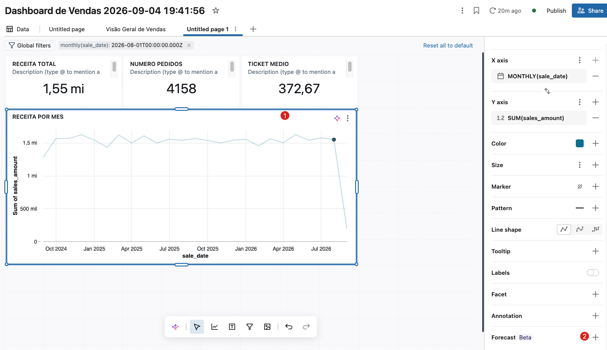

# Etapa 3 — Exercício B: criação manual de visualizações

**Pré-requisitos e permissões:** iguais à Etapa 1. Use o dataset `vendas_detalhe`.

Aqui você aprende a fazer "no braço" o que o Genie fez — para dominar cada controle. Todos os gráficos abaixo usam o dataset **`vendas_detalhe`**.

### 8.0 Como adicionar uma visualização (vale para todos os gráficos)

**1.** Abra a aba **Canvas**. Na barra de ferramentas (parte inferior/central), clique no ícone de **visualização** (gráfico) e desenhe o widget na tela — ou use **Add visualization**.

**2.** Com o widget selecionado, o **painel de configuração** abre à direita. Em **Dataset**, escolha **`vendas_detalhe`**.

**3.** Em **Visualization**, escolha o **tipo** de gráfico (Counter, Line, Bar, Table…).

**4.** Preencha os campos que aparecem (**X axis**, **Y axis**, **Value**, **Columns**…). Para cada **campo numérico**, clique nele e defina a **agregação** no menu (SUM, COUNT, COUNT DISTINCT, AVG…). Para campos de **data**, clique e escolha o **agrupamento** (por mês, por dia…).

**5.** Marque **Title** no topo do painel e dê um nome ao widget. Ajuste rótulos, formato de número e cores se quiser.

> Repita esse fluxo para cada gráfico abaixo. É sempre o mesmo: **adicionar widget → escolher dataset → escolher tipo → mapear campos → agregação → título**.

### 8.1 Counters (KPIs) — três números no topo

> **Atenção ao dataset (leia antes de começar):** aqui usamos o **`vendas_detalhe`** (o dataset SQL da Etapa 1), que tem as **colunas cruas** `sales_amount` e `sale_id` — é sobre elas que aplicamos SUM/COUNT/AVG. **Não** use o `vendas_overview` que o **Genie** criou no Exercício A: ele já vem com **medidas prontas** (`total_revenue`, `order_count`, `avg_ticket`) e **não** expõe as colunas cruas. Se no editor você só vê `total_revenue`/`order_count`/`avg_ticket`, é porque o widget está no dataset do Genie — troque o **Dataset** (no painel à direita) para **`vendas_detalhe`**. As duas formas são válidas; aqui praticamos a construção manual.

Um **Counter** mostra **um único número**. Crie três (repetindo o fluxo do 8.0):

**a) Receita total** — Visualization: **Counter**; campo **Value** = **`sales_amount`** com agregação **SUM**; Title = "Receita total". (Opcional: formate como **moeda** e ative a comparação com o período anterior.)

**b) Nº de pedidos** — Visualization: **Counter**; **Value** = **`sale_id`** com agregação **COUNT DISTINCT** (conta pedidos únicos); Title = "Nº de pedidos".

**c) Ticket médio** — Visualization: **Counter**; **Value** = **`sales_amount`** com agregação **AVG**; Title = "Ticket médio". (Opcional: formato **moeda**.)

Arraste os três counters para ficarem **lado a lado no topo** do canvas.

**Analogia:** counters são o "painel do carro" — os números que você quer ver de relance.

### 8.2 Gráfico de linha — receita ao longo do tempo

**1.** Adicione uma visualização (8.0) e em **Visualization** escolha **Line**. Dataset: **`vendas_detalhe`**.

**2.** **X axis:** selecione **`sale_date`**. Clique no campo e escolha o **agrupamento por mês** (MONTHLY) — assim cada ponto no eixo é um mês. (Não há tabela de calendário; a data vem do próprio fato. Se preferir um campo mensal explícito, use `date_trunc('month', sale_date)`.)

**3.** **Y axis:** selecione **`sales_amount`** e defina a agregação **SUM**.

**4.** Marque **Title** = "Receita por mês". Pronto: você vê a evolução mensal da receita. (Opcional: em **Y axis**, formate como moeda.)

#### AI Forecast (previsão)

**O que é o AI Forecast?** É a capacidade da Databricks de **projetar o futuro** de uma série temporal (ex.: receita por mês) automaticamente, sem você treinar modelo nenhum. Por baixo, ela usa a função SQL **`AI_FORECAST`**, que ajusta um modelo estatístico (tendência + sazonalidade, estilo *Prophet*) e devolve, para cada período futuro: a **previsão** (`_forecast`) e uma **faixa de confiança** (`_upper` / `_lower`). Requer **SQL Warehouse Pro ou Serverless**.

Sempre faça a previsão sobre uma **série temporal simples** (uma coluna de data + uma medida numérica). Primeiro crie o dataset base (**Data → Add SQL dataset**), renomeado para **`vendas_forecast`**:

```sql
-- Serie mensal de receita (so meses completos) - ideal para forecast
SELECT
  date_trunc('MONTH', f.sale_date) AS mes,
  SUM(f.sales_amount)              AS total_sales
FROM dbacademy.workshop_aibi.fact_sales f
WHERE f.sale_date < date_trunc('MONTH', current_date())   -- remove o mes incompleto
GROUP BY date_trunc('MONTH', f.sale_date)
ORDER BY mes
```

Há **duas formas** de gerar a previsão. Escolha uma.

##### Opção A — Pelo botão do gráfico (Clone and forecast)

**1.** Selecione o gráfico de linhas criado no item 8.2

**2.** Clique na opção do gráfico (a última) **✨ Forecast** no canto do painel de configuração. A Databricks **gera automaticamente** um novo dataset com a query de `AI_FORECAST` e um gráfico do tipo **Line (forecast)**, já com as séries **Prediction / Prediction Upper / Prediction Lower** mapeadas (`total_sales_forecast`, `total_sales_upper`, `total_sales_lower`).



**3. Como definir o horizonte:** o "Clone and forecast" **não** abre um campo "meses" — ele grava o horizonte **dentro da query gerada**, no argumento `horizon =>` da função `AI_FORECAST`. Por padrão projeta **metade do período histórico** (o trecho `FLOOR(DATEDIFF(...) * 0.5)`).

> **Importante:** o menu **⋮ → View visualization query** é **somente leitura** (só dá para *ler* e **copiar** a query com o ícone no canto — não dá para editar por ali). Ou seja, pelo caminho A **você não altera o horizonte diretamente**.
>
> Para **controlar o horizonte**, use uma destas saídas:
> - **Recomendado — Opção B (abaixo):** escreva o `AI_FORECAST` num **Add SQL dataset** seu; lá o `horizon =>` é totalmente editável.
> - **Ou** copie a query do "View visualization query" (ícone de copiar), crie um **Add SQL dataset** novo, cole, edite o `horizon =>` e aponte um gráfico Line para esse dataset.

O `horizon` espera **uma data/timestamp final** (até quando prever), não um número de passos. Exemplos:

```sql
-- Horizonte fixo: prever ate uma data especifica
horizon => DATE'2027-06-01'

-- Horizonte relativo: 6 meses apos a ultima data observada
horizon => (SELECT add_months(MAX(mes), 6) FROM original_table)
```

> No seu caso, a projeção **já apareceu** (a linha tracejada + a faixa sombreada à direita): está funcionando com o horizonte padrão. Só troque o `horizon` se quiser esticar/encurtar quantos meses prever.

##### Opção B — Chamando `AI_FORECAST` direto no dataset (SQL)

Você também pode escrever a função **você mesmo**, num **Add SQL dataset**. Dá controle total sobre o horizonte e a faixa de confiança.

**B.1 — A previsão "pura" (só os meses futuros).** Uma chamada direta de `AI_FORECAST`:

```sql
-- Previsao de receita mensal com AI_FORECAST (12 meses a frente)
WITH serie AS (
  SELECT
    date_trunc('MONTH', f.sale_date) AS mes,
    SUM(f.sales_amount)              AS total_sales
  FROM dbacademy.workshop_aibi.fact_sales f
  WHERE f.sale_date < date_trunc('MONTH', current_date())
  GROUP BY date_trunc('MONTH', f.sale_date)
)
SELECT *
FROM AI_FORECAST(
  TABLE(serie),
  horizon    => (SELECT add_months(MAX(mes), 12) FROM serie),
  time_col   => 'mes',
  value_col  => 'total_sales',
  prediction_interval_width => 0.95
)
```

**Argumentos principais da `AI_FORECAST`:**
- **`TABLE(serie)`** — a tabela de entrada (sua série histórica).
- **`horizon`** — **até quando** prever (uma data/timestamp). Ex.: `add_months(MAX(mes), 12)`.
- **`time_col`** — a coluna de tempo (DATE/TIMESTAMP). Aqui, `'mes'`.
- **`value_col`** — a coluna numérica a prever (`'total_sales'`). Pode ser uma lista para prever várias métricas.
- **`prediction_interval_width`** (opcional, 0–1) — largura da faixa de confiança (0.95 = 95%).
- **`group_col`** (opcional) — para prever **por grupo** (ex.: uma série por `region` ou por `category`).

O resultado traz `mes`, `total_sales_forecast`, `total_sales_upper`, `total_sales_lower`.

> **Atenção:** essa query B.1 devolve **só os meses futuros** — **não** traz o histórico. Se você plotar só ela, o gráfico "começa no futuro", sem a linha real anterior. Para ver **histórico + previsão juntos**, use a query B.2 abaixo (recomendado).

**B.2 — O gráfico completo (histórico + previsão na mesma linha).** Une a série real com a previsão, alinhando as colunas — é o que produz o gráfico "linha cheia até hoje + linha tracejada com a faixa para o futuro":

```sql
-- Historico + previsao juntos (para o grafico completo)
WITH serie AS (
  SELECT
    date_trunc('MONTH', f.sale_date) AS mes,
    SUM(f.sales_amount)              AS total_sales
  FROM dbacademy.workshop_aibi.fact_sales f
  WHERE f.sale_date < date_trunc('MONTH', current_date())
  GROUP BY date_trunc('MONTH', f.sale_date)
),
fc AS (
  SELECT *
  FROM AI_FORECAST(
    TABLE(serie),
    horizon   => (SELECT add_months(MAX(mes), 12) FROM serie),
    time_col  => 'mes',
    value_col => 'total_sales',
    prediction_interval_width => 0.95
  )
)
-- linhas do passado: preenchem 'total_sales' (previsao fica NULL)
SELECT mes, total_sales,
       CAST(NULL AS DOUBLE) AS total_sales_forecast,
       CAST(NULL AS DOUBLE) AS total_sales_upper,
       CAST(NULL AS DOUBLE) AS total_sales_lower
FROM serie
UNION ALL
-- linhas do futuro: preenchem previsao/faixa (total_sales fica NULL)
SELECT mes, CAST(NULL AS DOUBLE) AS total_sales,
       total_sales_forecast, total_sales_upper, total_sales_lower
FROM fc
ORDER BY mes
```

**Como criar a visualização (para a query B.2):**

1. Rode o dataset e **renomeie** para **`vendas_forecast_sql`** (clique no nome "Untitled dataset").
2. Vá para a aba **Canvas** (a página) e adicione uma visualização.
3. **Dataset:** `vendas_forecast_sql`. **Visualization:** escolha **`Line (forecast)`** (fim da lista, seção *Advanced*).
4. Mapeie os campos:
   - **X axis:** `mes`
   - **Y axis → Original:** `total_sales` (a linha histórica cheia)
   - **Y axis → Prediction:** `total_sales_forecast` (a linha tracejada)
   - **Y axis → Prediction Upper:** `total_sales_upper`
   - **Y axis → Prediction Lower:** `total_sales_lower` (as duas formam a faixa sombreada)
5. Marque **Title** = "Receita: histórico + previsão". Pronto — a linha real vai até hoje e a projeção continua para o futuro, com a faixa de confiança.

> Se preferir um gráfico mais simples (só a projeção), use a query **B.1** com uma visualização **Line** comum: X = `mes`, Y = `total_sales_forecast`.

> **Dicas e armadilhas comuns do Forecast:**
> - **Não** crie/aponte uma coluna `*_forecast` na mão para os counters/gráficos normais — quem gera a previsão é o recurso/função.
> - Faça o forecast sobre um **SQL dataset simples** (série temporal), **não** sobre uma *metric view* (lá o "Clone and forecast" falha, pois só existem as medidas do YAML; e toda medida exigiria `MEASURE()`).
> - Filtrar o mês incompleto (o `WHERE` acima) evita o "penhasco" no fim da linha.
> - `AI_FORECAST` exige **SQL Warehouse Pro ou Serverless** (é Public Preview).


[FIM]
